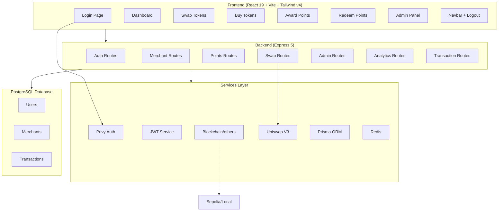

# LoyalChain — Complete App Implementation Plan

## Architecture Overview



## Current State (Before Fixes)

| Component | Status | Issues |
|-----------|--------|--------|
| Backend routes (7 modules) | ✅ Working | Missing `GET /admin/merchants` |
| Backend tests (6) | ✅ All pass | — |
| E2E tests (17) | ✅ All pass | — |
| Login page | ⚠️ Partial | No logout flow; wallet option present |
| Dashboard | ⚠️ Partial | No regular user balance; no analytics |
| Swap page | ✅ Working | — |
| TopUp page | ✅ Working | — |
| MerchantPanel (Award) | ✅ Working | — |
| Redemption | ⚠️ Partial | Hardcoded token contract |
| Admin page | ❌ Broken | Calls non-existent `GET /admin/merchants` |
| Navbar | ❌ Missing | No navigation between pages |
| Logout button | ❌ Missing | No way to log out |

---

## Implementation Phases

### Phase 1: Backend Missing Routes

#### 1.1 Add `GET /api/admin/merchants`
**File:** `backend/routes/admin.js`
- List ALL merchants (not just pending)
- Include user info (wallet, email, name)
- Order by `createdAt desc`
- Auth + admin middleware

#### 1.2 Add Analytics Routes
**New file:** `backend/routes/analytics.js`
- `GET /api/analytics/merchant` — merchant's own KPIs (total awarded, total redeemed, active customers, trends by day/week)
- `GET /api/analytics/admin` — platform-wide KPIs (total users, merchants, transactions, volume, approval rate)
- Derive all data from existing `Transaction` table — no new model needed

**Mount in `backend/index.js`:**
```js
app.use("/api/analytics", require("./routes/analytics"));
```

---

### Phase 2: Frontend — Navigation & Layout

#### 2.1 Create `Navbar.jsx`
**File:** `frontend/src/components/Navbar.jsx`

Persistent top bar on every page except login:
```
┌─────────────────────────────────────────────────────────┐
│ 🪙 LoyalChain    │ Dashboard  Swap  │ user@email.com  │
│                  │ TopUp*  Award*   │   [Logout]      │
│                  │ Redeem*  Admin** │                  │
└─────────────────────────────────────────────────────────┘
* = merchant only  ** = admin only
```

Features:
- Responsive — hamburger menu on mobile (using `lucide-react` `Menu` icon)
- Active link highlighting
- User email display (truncated)
- Logout button → calls `logout()` from AuthContext + `privyLogout()` from Privy → redirects to `/login`
- Conditional links based on `user.isMerchant` and admin status

#### 2.2 Create `Layout.jsx`
**File:** `frontend/src/components/Layout.jsx`

Simple wrapper:
```jsx
<>
  <Navbar />
  <main className="...">{children}</main>
</>
```

#### 2.3 Fix `App.jsx`
**File:** `frontend/src/App.jsx`

- Wrap protected routes with `<Layout>`
- Login route stays without Layout
- Pass `loading` from AuthContext to `<P>` component

```jsx
<Route path="/login" element={user ? <Navigate to="/dashboard" /> : <Login />} />
<Route path="/dashboard" element={<P><Layout><Dashboard /></Layout></P>} />
<Route path="/swap" element={<P><Layout><Swap /></Layout></P>} />
// ... same for all protected routes
```

---

### Phase 3: Frontend — Page Fixes

#### 3.1 Fix `Login.jsx` — Remove Wallet Option, Add Proper Logout
**File:** `frontend/src/pages/Login.jsx`

- Remove wallet login (only email via Privy)
- After Privy auth → role choice screen
- Merchant form has business name + registration fields
- "Use a different email" button properly calls `privyLogout()`
- Show clean error messages
- Loading states on buttons

#### 3.2 Fix `Dashboard.jsx` — Role-Based View + Analytics

**For Regular Users:**
- Points balance: call `GET /api/points/balance/:walletAddress` (public endpoint)
- Recent transactions
- Quick links: Swap, Redeem
- No merchant-specific sections

**For Merchants:**
- Token info (supply, symbol, contract)
- Balance
- Quick KPIs from `GET /api/analytics/merchant`:
  - Total points awarded
  - Total points redeemed  
  - Number of unique customers
  - Daily trends (simple chart using CSS bars or lucide icons)

**For Admins (visible on admin page, not dashboard):**
- Keep admin stats on `/admin` page only

#### 3.3 Fix `Admin.jsx`
**File:** `frontend/src/pages/Admin.jsx`

- Remove broken `admin.merchants()` call
- Add "All Merchants" tab using new `GET /admin/merchants` endpoint
- Tabs: Pending | All Merchants | Stats
- Approval denies + approve buttons on pending tab
- Table of all merchants with status badges

#### 3.4 Fix `Redemption.jsx`
**File:** `frontend/src/pages/Redemption.jsx`

- Remove hardcoded `tokenContract`
- Fetch merchant's token contract from `/api/merchant/status` or the merchant context
- Use `points.redeem()` without hardcoded token

#### 3.5 Polish `<title>` and Index
**File:** `frontend/index.html`

- Change `<title>` from "frontend" to "LoyalChain"
- Add meta description

---

### Phase 4: Backend — Admin Merchants Route

#### 4.1 Add route in `backend/routes/admin.js`
```js
router.get("/merchants", auth, admin, async (req, res) => {
  const merchants = await prisma.merchant.findMany({
    include: { user: { select: { walletAddress: true, email: true, name: true } } },
    orderBy: { createdAt: "desc" },
  });
  res.json({ merchants });
});
```

#### 4.2 Add route for analytics

```js
// backend/routes/analytics.js
router.get("/merchant", auth, async (req, res) => { ... });
router.get("/admin", auth, admin, async (req, res) => { ... });
```

Each endpoint aggregates from `Transaction` table using Prisma groupBy/aggregate.

---

### Phase 5: Testing

#### 5.1 Update E2E Tests
**File:** `frontend/e2e/loyalchain.spec.js`

- Add test for Navbar visibility on dashboard
- Add test for Admin "All Merchants" tab loading
- Add test for logout flow (if possible in Playwright)
- Add test for analytics endpoint

#### 5.2 Run All Tests
- Backend: `cd backend && node --test tests/` (6 tests)
- Frontend E2E: `cd frontend && npx playwright test` (17+ tests)
- Build: `cd frontend && npm run build`

#### 5.3 Fix Any Failures
Iterate until all tests pass.

---

## Files Changed Summary

| File | Action | Description |
|------|--------|-------------|
| `backend/routes/admin.js` | Edit | Add `GET /merchants` route |
| `backend/routes/analytics.js` | **Create** | Merchant + admin analytics endpoints |
| `backend/index.js` | Edit | Mount analytics routes |
| `frontend/src/components/Navbar.jsx` | **Create** | Navigation bar with logout |
| `frontend/src/components/Layout.jsx` | **Create** | Layout wrapper (Navbar + content) |
| `frontend/src/App.jsx` | Edit | Wrap routes with Layout |
| `frontend/src/pages/Login.jsx` | Edit | Remove wallet, fix logout flow |
| `frontend/src/pages/Dashboard.jsx` | Edit | Role-based view, regular user balance |
| `frontend/src/pages/Admin.jsx` | Edit | Fix admin.merchants() call |
| `frontend/src/pages/Redemption.jsx` | Edit | Remove hardcoded token contract |
| `frontend/src/services/endpoints.js` | Edit | Add analytics endpoints |
| `frontend/index.html` | Edit | Fix page title |
| `frontend/e2e/loyalchain.spec.js` | Edit | Add new tests |

---

## Data Flow Diagrams

### Login Flow
```
User → Login Page → Click "Continue with Email"
  → Privy Modal (email OTP)
  → Privy authenticated
  → Role Choice Screen
    → "Regular User" → POST /auth/login { token }
    → "Merchant" → fill form → POST /auth/login { token, businessName }
      → Backend auto-approves, deploys mock token
  → Redirect to /dashboard
```

### Navbar/Logout Flow
```
User clicks [Logout]
  → AuthContext.logout() clears localStorage
  → usePrivy.logout() clears Privy session
  → Navigate to /login
  → Login page shows "Continue with Email" (fresh state)
```

### Points Flow
```
Merchant Dashboard → Award Points
  → Enter customer wallet + amount
  → POST /points/award { customerWallet, amount }
  → Backend: mints tokens (or mock), creates Transaction record
  → Success message with TX hash
```

---

## Risk Areas

1. **Privy session inconsistency** — Privy may retain session across page reloads. Need to ensure `authenticated` state is checked correctly in Login.jsx.
2. **Wallet-less users** — If a merchant doesn't have a wallet, blockchain operations (mint/burn) will use `0x0`. Mock mode handles this.
3. **Admin detection** — Currently based on `walletAddress` in `ADMIN_WALLETS` env var. Email-only admins have no wallet. Need a fallback: check if user is in an admin table or has a special flag.
4. **Mobile responsiveness** — Navbar needs to collapse on small screens.

---

## Decision Needed: Admin Detection for Email-Only Users

Currently admin check: `ADMIN_WALLETS` env var checks `req.user.walletAddress`. Email-only users have `walletAddress = null`, so they can never be admins.

**Options:**
1. Add an `isAdmin` boolean field to the `User` model in Prisma
2. Keep wallet-based check (existing admin wallet works: `0xf39Fd6e51aad88F6F4ce6aB8827279cffFb92266`)

I recommend **option 1** for future-proofing, but **option 2** is simpler and works now since the admin wallet is set.

---

## Timeline

| Phase | Estimated Steps | Dependencies |
|-------|----------------|--------------|
| Phase 1: Backend routes | 2 edits + 1 create | None |
| Phase 2: Frontend nav | 2 creates + 1 edit | Phase 1 (endpoints needed) |
| Phase 3: Page fixes | 4 edits | Phase 2 (Layout in place) |
| Phase 4: Testing | 1 edit + run | All phases complete |
| Phase 5: Polish/Fix | Per failure | Test results |
